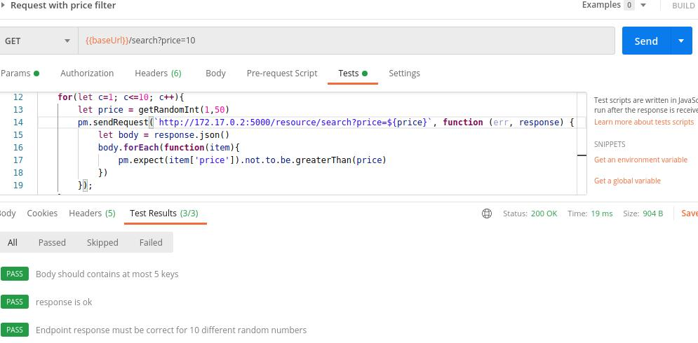
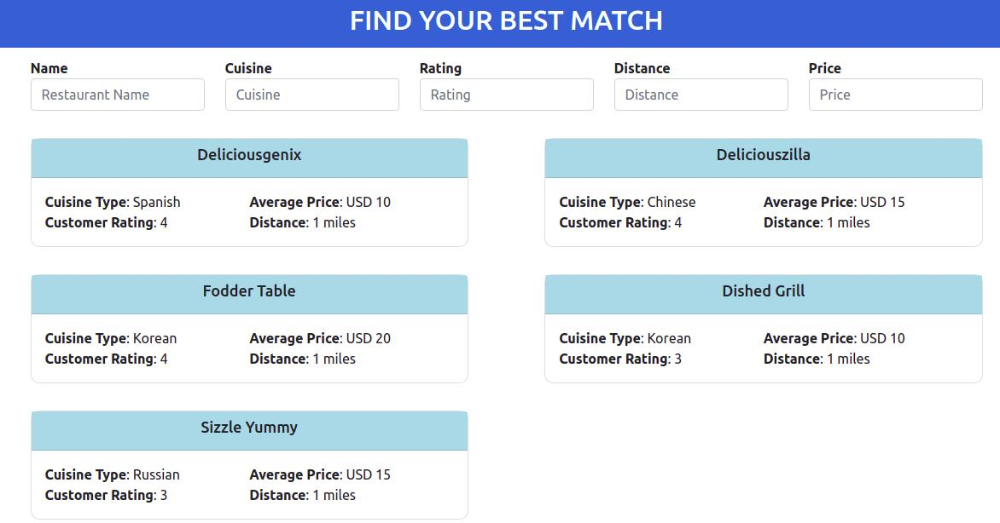
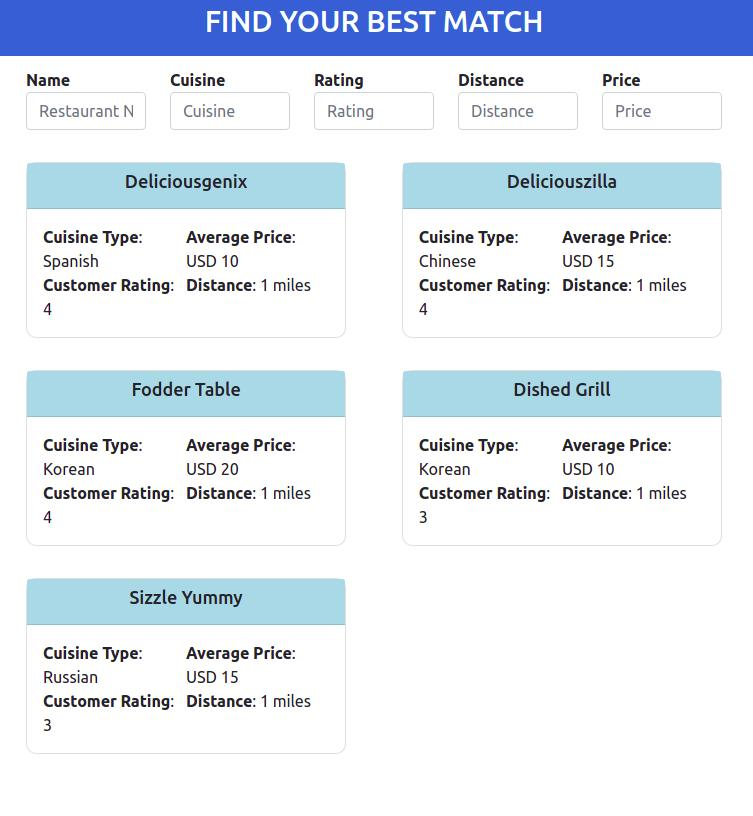

# Cuisine Project

### Technologies

- **Backend**: Python with Flask Framework, reading json content with Pandas library
- **Front-end** : Angular
- **Database**: No database, just two .csv files with content to manage

#### Running
- Using docker-compose, just run:
`docker-compose up`

### Backend

#### Design
+ The backend has 3 files only:
	* **controller.py**:  Module where the dataframe is built, filters are applied and search processed.
	* **resource.py**:  Where all the endpoints of REST API are registered and responses are processed.
	* **__init__.py**: Inside app folder, it is the file that creates the Flask app and its context through the whole project. 

#### Endpoints
- **[GET] /resource/search**
	- No requested params.
	- For every request the python library Pandas merges the restaurants.csv and cuisine.csv into one datframe. 
	- Optional params are: **name_restaurant, name_cuisine, price, distance, customer_rating**.
	- If the keys or the values are invalid, a message with status 400 will be sent as response.
	- The sort order is **1.Distance, 2.Customer Rating, 3. Avg. Price, 4.Restaurant Name and 5.Cuisine Name**.
	- It searches restaurants based on the params.

#### Testing on Postman

- The root folder has a file called **cuisine.postman_collection.json".
- It's json file containing a test suite with 6 different request for testing purpose.
- Every request has at least 2 tests.
- It's necessary to import the json file into Postman. Instructions are here: https://kb.datamotion.com/?ht_kb=postman-instructions-for-exporting-and-importing

### Front-end

- The front-end project was created using **Angular CLI**.
- First all, **Node.js** it is required so later we can install the packages we need and mainly, run the app. Follow instructions: https://nodejs.org/en/download/.

- It is necessary to have it installed to run the app. Follow instructions here:  https://angular.io/cli.

#### Design

- There is one module called **best-match**, it contains the component **search-component**.
- The UI looks like this:

- It is responsive:

- It shows at most 5 best restaurants according to filter's values added on top of the cards.

- To run the app, just type inside movie-app:
	 `ng serve`

- Open the browser on **localhost:4200**

#### Testing

- Inside the folder frontend/cuisine-app, run:
`ng test`

- That should be the expected result:
